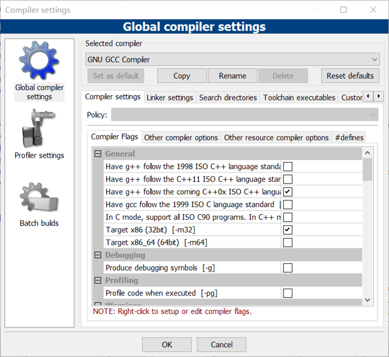

# Drawing-interpreter
绘图语言的解释器，满足你对于一个绘图语言的美丽想象。

## 运行
windows 10  
在codeblocks中建立项目 把所有的源代码添加到项目中  
编译选项如下图  


把测试样例放在某个windows系统中的位置，如E盘
然后在main.c当中修改打开的文件位置，如图所示

点击编译和运行 就可以看到美丽的图像了：）

如果遇到问题可以发邮件给我 我的邮箱是ddy_mainland@163.com

## 支持的语法规则
```
origin is （100,300);     --设置原点的偏移量  
rot is 0；                --设置旋转角度（不旋转）  
scale is (1,1);          --设置横纵坐标的比例  
for t from 0 to 200 step 0.01 draw(t,cos(t));  --设置坐标的轨迹  
color is 234 234 123 ;    --设置点的颜色
```
其他可以运行的细节可以参考样例。

## 样例一
！[data1](./pic/pic1.png)
## 样例二
！[data2](./pic/pic2.png)
## 样例三
！[data3](./pic/pic3.png)
